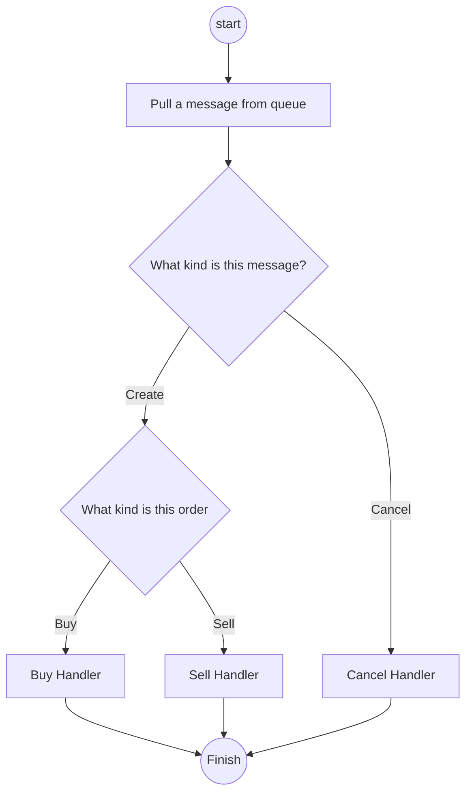
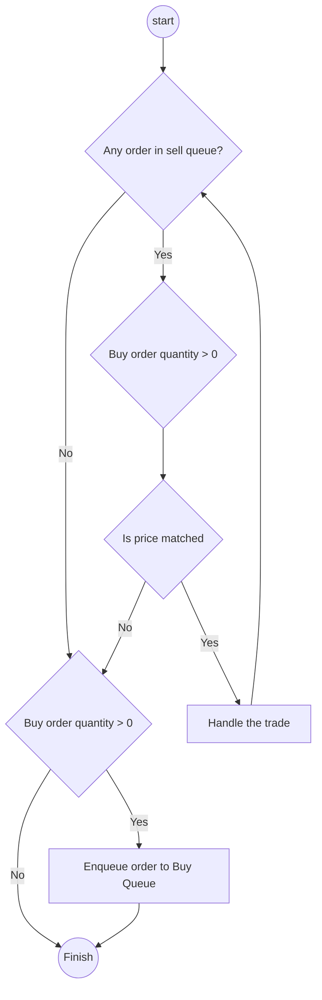

# trading-matching-service

## Description
A financial trading matching service. The service accepts buy/sell orders and matches buy and sell orders that have the same price. Any valid order should have the following information that is it a buy/sell order, quantity, and is it a market price or limit price? If orders have the same price, the priority will be determined by their time stamp (FIFO). Pending orders queue up in the system until they are filled or canceled.

## Features
**Easy to upgrade components for higher availability, scalability...**
There are three critical components used in this project, which are message queue, priority queue, and order store. Currently, they are implemented in memory for POC only. To make the system more production-ready, you can choose some external solutions and import them to the system easily by implementing the predefined interface.

**In-memory match engine**
The matching algorithm is run at the memory level. The match engine doesn't need to query the disk for the order information.

**High request concurrency supported**
When the server receives a request, this request will be pushed into the message queue. This design means the server would not burst out of system resources and can handle the requests at a certain speed.

**Data consistency and data recoverability from server crash promised**
Since we can choose another more stable service as an alternative for a message queue. For example, Rabbitmq helps us to keep the messages in the queue if they are not ACKed from the server. This support is considered especially for the case that the server is down because of some unexpected disasters like out of electricity or server panic.

## How To Run

**Run server**
``` bash
make install-swag # run it if you don't have swag command.
make run
```

**Run server in docker**
``` bash
make rund
```

*NOTE: After running the server, you can open your browser with `http://127.0.0.1:9000/swagger-ui/` to use swagger ui to fire requests.*

## How to Test

**Run test**
``` bash
make test
```

*NOTE: If you don't want use swagger to test the service, you can add test cases in `${REPO}/test/unittest/matching_test.go`.*

## How To Place An Buy/Sell Order Or Cancel An Order

**Create Order Example**


``` bash
curl -X 'POST' \
  'http://localhost:9000/api/v1/orders' \
  -H 'accept: application/json' \
  -H 'Content-Type: application/json' \
  -d '{
  "order_kind": ${the_order_kind},
  "price": ${the_price},
  "price_type": ${the_price_type},
  "quantity": ${the quantity}
}'
```

**Cancel Order Example**
``` bash
curl -X 'DELETE' \
  'http://localhost:9000/api/v1/orders/${the_order_id}' \
  -H 'accept: application/json'
```

## Service Architecture


## Flowcharts

**Flowchart of match engine handling a message**

**Flowchart of buy handler handling a buy order**


**Flowchart of sell handler handling a sell order**

